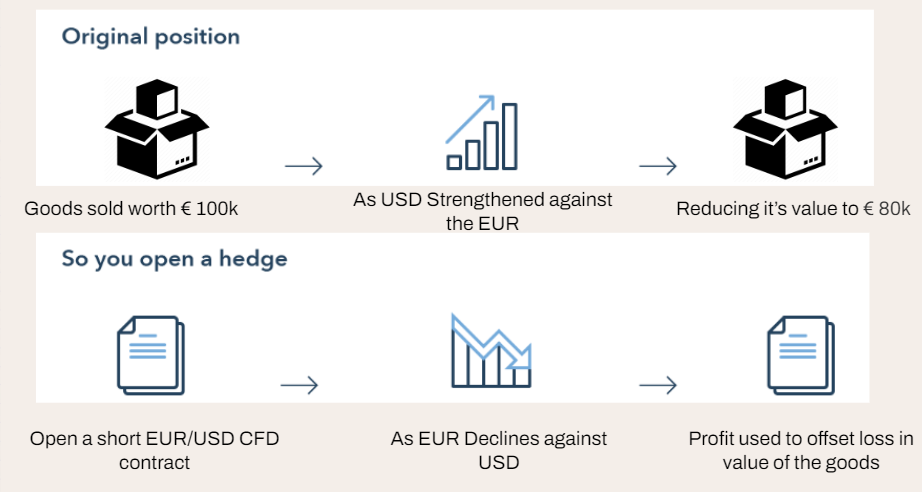
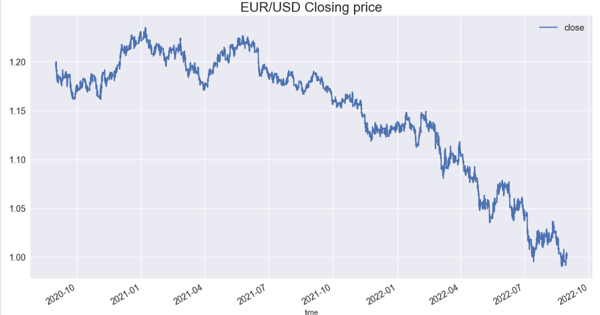
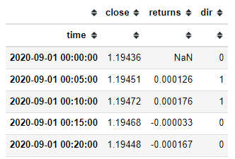
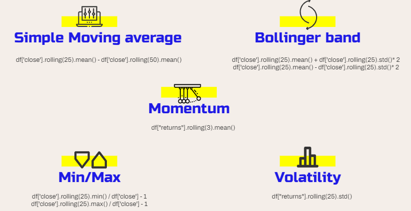
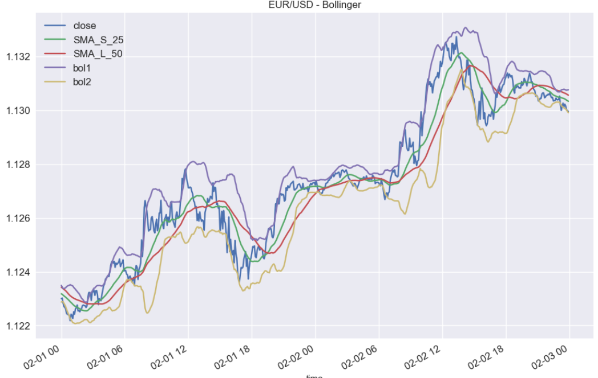
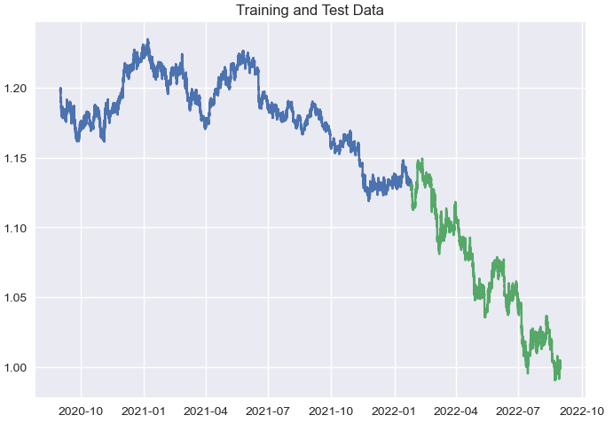
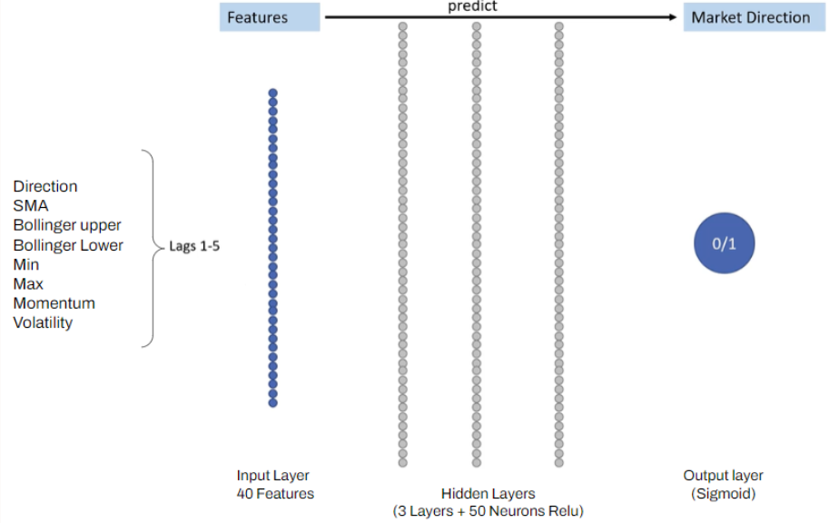
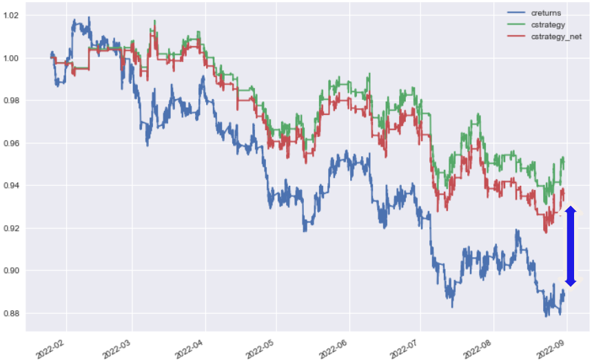

# Forex API Trader
 - [Notebook Contents](#Notebook-Contents)
 - [Problem Statement](#Problem-Statement)
 - [Data Sources](#Data-Sources)
    - [Defining the target variable](#Defining-the-target-variable)
        - [EDA](#EDA)
        - [Feature Transformation](#Feature-Transformation)
        - [Feature Engineering](#Feature-Engineering)
        - [Modelling](#Modelling)
 - [Conclusion](#Conclusion)
 - [Improvements](#Improvements)

---
## Notebook Contents
1. [01_data_cleaning_EDA_Feature_engineering] 
2. [02_DNN_Modeling]
3. [03_Log_reg_model]
4. [04_XGB_model]
5. [05_SHAP]
6. [06_Implementation-NLP]
---
 
## Problem Statement
Companies that conduct business internationally are exposed to foreign currency risk. This risk arises from the possibility that the value of a foreign currency will change in a way that is unfavorable to the company. For example, if a company exports goods to a country whose currency weakens against the company's home currency, the company will receive less revenue from the sale when it converts the foreign currency back to its home currency. This can lead to financial losses for the company. To hedge against this risk, companies typically use financial instruments such as futures contracts or options.

The Costs associated to such hedging stratedgies are but not limited to: 
1) Upfront Premium Costs
2) Ongoing costs for maintaining the hedge
3) Opportunity cost of not cashing in on favourable movements 

Our aim for this project is to provide an alternative to such complex hedging strategy, and instead to utilise a simple API that can run in the background with minimal human intervention.

--- 
## Data Sources
The sources of the data will be pulled from Oanda's API.

#### Main dataset
We pulled the EUR_USD pair with a granularity of 5mins, from the period of 2020-09-01 to 2022-08-31 (24 months).
A total of 148,874 rows of data.

 
---

>### Defining the target variable

1) We create a new column called "Returns"
>The returns column is the log difference between the current and previous price "df["returns"] = np.log(df["close"].div(df["close"].shift(1))"
2) Next we get our target value based on returns.  
>If it is more than 0 then assign value of 1 (BUY),  
>if <= 0 assign value of 0 (SELL)

> ### Feature Transformation

Added 5 transformed features as per the image above.
- These features are then shifted backwards for period of 1days for 5 times (lag1, lag2, lag3, lag4, lag5)
---

> ### EDA

  
Plotted out the technical indicators 

**Train Test Split**   
      
  
Train 70%: From 2020-09-01 to 2022-01-25  
Test 30% : From 2022-01-25 to 2022-08-31  

The features that will be used for predicting are only the shifted columns.  
The reason is that when we are deploying the ML model, the Current price will not be available, and prediction will need to be based on past price (in this case features from 5mins ago)

So to summerize, only the columns indicated below will be used in pediction.

    'dir_lag_1', 'dir_lag_2', 'dir_lag_3', 'dir_lag_4', 'dir_lag_5',
    'sma_lag_1', 'sma_lag_2', 'sma_lag_3', 'sma_lag_4', 'sma_lag_5',
    'bol1_lag_1', 'bol1_lag_2', 'bol1_lag_3', 'bol1_lag_4', 'bol1_lag_5',
    'bol2_lag_1', 'bol2_lag_2', 'bol2_lag_3', 'bol2_lag_4', 'bol2_lag_5',
    'min_lag_1', 'min_lag_2', 'min_lag_3', 'min_lag_4', 'min_lag_5',
    'max_lag_1', 'max_lag_2', 'max_lag_3', 'max_lag_4', 'max_lag_5',
    'mom_lag_1', 'mom_lag_2', 'mom_lag_3', 'mom_lag_4', 'mom_lag_5',
    'vol_lag_1', 'vol_lag_2', 'vol_lag_3', 'vol_lag_4', 'vol_lag_5'

---

> ### Feature Engineering
Standard Scaler wad used to scale the dataset.
---

> ### Modelling

  
We created a Keras Sequential Model with 3 hidden layers, using Relu activator and Sigmoid for the outer layer
---

> ### Model Evaluation

Comparing it with a baseline model of Buy and Hold till the end,  
our models performs 5% better (after factoring trading cost of 1 basis point.

---
## Conclusion 

The ML model is much easier to use as compared to the other hedging strategies.  
The Model Shows that it is much better than buying and holding on to EUR.
The model allows users to take advantage of favourable price movements.

---

## Improvements

### Data Drift

Data drift is a process whereby data changes over time. This can happen for a variety of reasons, including changes in the underlying distribution of the data, changes in the way the data is collected or processed, or simply because the data is old and no longer accurate. Data drift can be a problem for machine learning models because it can cause the models to become inaccurate over time.
This can be a result of change is investors sentiment, change in economic trends or changes in political environment.
As such the Model needs to be retrained periodically to ensure optimal performance.

### Take Profit + Stop Loss  
Generally the model will only trade if there is a strong buy or sell indicator.  
This can be an issue with regards to cashing in at the most optimal point if the model dosent detect it as being a strong direction. This is the same for losses.
As such we should consider adding code to take profit/stop loss at certain threshold.
This can be achieved easily with OANDA's API as it does offer this kind of functionality.

---
